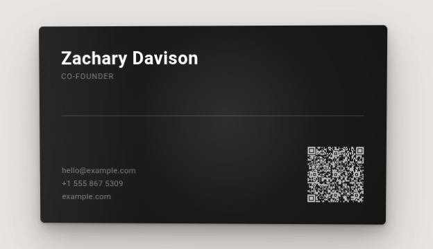

# card.ooo

**[Generate your card here!](https://zdavison.github.io/card.ooo/)**

Interactive 3D virtual business cards. Pass your contact data, get back a self-contained HTML page with tilt and shine effects.



## Usage (in code)

```ts
import { renderCard } from "card.ooo";

const html = await renderCard({
  name:     "Zachary Davison",
  jobTitle: "Co-Founder",
  org:      "Little Tone Records",
  email:    "label@littletonerecords.com",
  phone:    "+353834840209",
  url:      "https://littletonerecords.com",
  logo:     "/assets/logo.png",     // optional
  theme: {                          // optional
    background: "#111",
    text:       "#fff",
    accent:     "rgba(255,255,255,0.4)",
  },
  qrCode: "<svg>...</svg>",         // optional, auto-generated if omitted
});
```

Serve it from any route:

```ts
Bun.serve({
  routes: {
    "/card": () => new Response(html, {
      headers: { "content-type": "text/html" },
    }),
  },
});
```

## Development

```sh
bun install
bun dev       # example server at http://localhost:3000
bun test      # run tests
```
